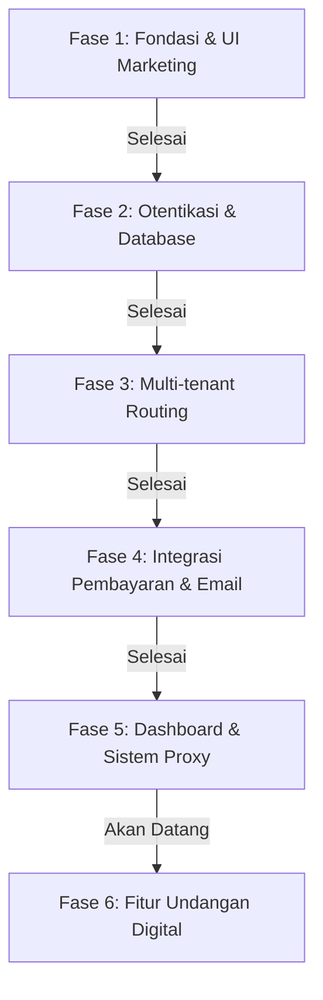

# Roadmap Pengembangan Upshare (upshare.id)

Dokumen ini berisi daftar pencapaian (progress) dan rencana pengembangan platform SaaS berbagi file **Upshare** langkah demi langkah.

---

## 🗺️ Gambaran Fase Pengembangan

---

## ✅ Fase 1: Fondasi Proyek & Landing Page (Selesai)
Fokus pada pembuatan struktur folder Next.js (App Router), desain sistem dengan palet warna Soft/Pastel Blue, dan komponen utama Landing Page.

*   [x] Inisialisasi proyek Next.js 16 (Turbopack) & Tailwind CSS v4.
*   [x] Integrasi UI Components `shadcn/ui` (Preset Radix Nova + Geist Font).
*   [x] Konfigurasi global CSS dengan variabel oklch untuk tema Soft Blue premium.
*   [x] Pembuatan komponen Landing Page (Responsive & Mobile-first):
    *   Navbar dinamis & interaktif.
    *   Hero Section modern dengan gradien halus.
    *   Features Section (fitur utama).
    *   Pricing Section (desain kartu paket harga menarik).
    *   CTA (Call to Action) Section.
    *   Footer Section (dilengkapi ikon sosial inline SVG).
*   [x] Konfigurasi file pendukung: `.gitignore` komprehensif, `.env.local.example`, dan `components.json`.

---

## ✅ Fase 2: Sistem Otentikasi & Supabase (Selesai)
Fokus pada pembuatan klien integrasi database, schema SQL, serta halaman login & register yang interaktif.

*   [x] Pembuatan SQL Schema Database Supabase (`supabase_schema.sql`):
    *   Tabel `profiles` untuk data user.
    *   Tabel `tenants` untuk subdomain kustom (multi-tenant).
    *   Tabel `files` untuk pelacakan unggahan file.
    *   Tabel `subscriptions` untuk status pembayaran paket/tier.
*   [x] Konfigurasi client Supabase:
    *   Browser Client (`src/lib/supabase/client.ts`).
    *   Server Client (`src/lib/supabase/server.ts` dengan Async Cookies API Next.js 16).
*   [x] Implementasi Server Actions untuk autentikasi (`src/app/actions/auth.ts`):
    *   Login menggunakan Email & Password (validasi Zod).
    *   Registrasi menggunakan Email & Password (dengan Password Strength Indicator).
    *   Login via Google OAuth.
    *   OAuth callback handler (`src/app/auth/callback/route.ts`).
    *   Fungsi Logout.
*   [x] Pembuatan Halaman UI Login & Register premium dengan layout dua kolom (sisi kiri menampilkan dekorasi premium/glassmorphism).

---

## ✅ Fase 3: Multi-tenant Routing & Subdomain (Selesai)
Fokus pada implementasi dynamic routing menggunakan Next.js Middleware agar setiap user memiliki subdomain personal mereka sendiri.

*   [x] Pembuatan `src/proxy.ts` untuk deteksi subdomain (misal: `cecep.upshare.id` atau `localhost:3000` dengan subdomain).
*   [x] Pemetaan subdomain dinamis dari proxy menuju halaman internal `src/app/[subdomain]/page.tsx`.
*   [x] Validasi subdomain aktif dari database Supabase sebelum menyajikan halaman personal tenant.
*   [x] Penanganan pengecualian untuk subdomain default/sistem (seperti `www`, `app`, `api`).

---

## ✅ Fase 4: Integrasi Pembayaran (Mayar.id) & Email Transaksional (Resend) (Selesai)
Fokus pada monetisasi platform dan notifikasi email setelah transaksi atau registrasi berhasil.

*   [x] Integrasi Checkout API Mayar.id untuk pembayaran paket subscription (Pro/Enterprise).
*   [x] Pembuatan API Route Webhook Mayar untuk menerima konfirmasi pembayaran dan memperbarui status tabel `subscriptions` di Supabase secara real-time.
*   [x] Integrasi Resend Email untuk pengiriman email transaksi otomatis (kwitansi pembayaran & konfirmasi akun).

---

## ✅ Fase 5: Dashboard & Sistem Proxy Subdomain (Selesai)
Fokus pada halaman aplikasi internal (Dashboard) tempat user mengatur URL target dan implementasi Reverse Proxy di Middleware.

*   [x] Pembaruan skema `tenants` di Supabase untuk menyimpan `target_url`.
*   [x] Pembuatan UI Dashboard yang modern (Sidebar navigation, Overview, Settings).
*   [x] Form manajemen URL Target di Dashboard untuk menyambungkan subdomain ke Netlify/Vercel.
*   [x] Integrasi Reverse Proxy (Rewrite) di `src/middleware.ts` & `src/proxy.ts` untuk memproses `target_url` secara otomatis (lengkap dengan sistem injeksi Watermark).

---

## ✅ Fase 6: Editor Undangan Digital & Sistem Tema (Selesai)
Fokus pada pembuatan fitur utama kedua dari Upshare: platform pembuat undangan pernikahan digital dengan live-preview.

*   [x] **Desain Skema Database Undangan:** Menambahkan JSONB `template_data` di tabel `tenants` (Sudah ada) dan mendefinisikan struktur data (Mempelai, Acara, Galeri).
*   [x] **Halaman Pemilihan Tema (`/dashboard/undangan/templates`):** Membuat galeri tema undangan (contoh: Premium Elegance, Rustic, Floral) yang bisa dipilih oleh user.
*   [x] **Live-Preview Editor (`/dashboard/undangan/[id]/edit`):** Membuat antarmuka editor di mana user bisa mengisi data (nama mempelai, tanggal) dan melihat perubahannya secara *real-time* di sisi kanan layar.
*   [x] **Mesin Render Tema (`src/app/[subdomain]/page.tsx`):** Menampilkan halaman undangan asli ke pengunjung (publik) berdasarkan tema dan data yang sudah disimpan oleh user.
