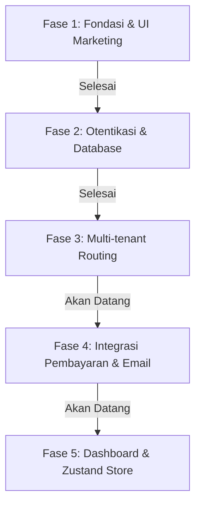

# Roadmap Pengembangan Upshare (upshare.id)

Dokumen ini berisi daftar pencapaian (progress) dan rencana pengembangan platform SaaS berbagi file **Upshare** langkah demi langkah.

---

## 🗺️ Gambaran Fase Pengembangan

---

## ✅ Fase 1: Fondasi Proyek & Landing Page (Selesai)
Fokus pada pembuatan struktur folder Next.js (App Router), desain sistem dengan palet warna Soft/Pastel Blue, dan komponen utama Landing Page.

*   [x] Inisialisasi proyek Next.js 16 (Turbopack) & Tailwind CSS v4.
*   [x] Integrasi UI Components `shadcn/ui` (Preset Radix Nova + Geist Font).
*   [x] Konfigurasi global CSS dengan variabel oklch untuk tema Soft Blue premium.
*   [x] Pembuatan komponen Landing Page (Responsive & Mobile-first):
    *   Navbar dinamis & interaktif.
    *   Hero Section modern dengan gradien halus.
    *   Features Section (fitur utama).
    *   Pricing Section (desain kartu paket harga menarik).
    *   CTA (Call to Action) Section.
    *   Footer Section (dilengkapi ikon sosial inline SVG).
*   [x] Konfigurasi file pendukung: `.gitignore` komprehensif, `.env.local.example`, dan `components.json`.

---

## ✅ Fase 2: Sistem Otentikasi & Supabase (Selesai)
Fokus pada pembuatan klien integrasi database, schema SQL, serta halaman login & register yang interaktif.

*   [x] Pembuatan SQL Schema Database Supabase (`supabase_schema.sql`):
    *   Tabel `profiles` untuk data user.
    *   Tabel `tenants` untuk subdomain kustom (multi-tenant).
    *   Tabel `files` untuk pelacakan unggahan file.
    *   Tabel `subscriptions` untuk status pembayaran paket/tier.
*   [x] Konfigurasi client Supabase:
    *   Browser Client (`src/lib/supabase/client.ts`).
    *   Server Client (`src/lib/supabase/server.ts` dengan Async Cookies API Next.js 16).
*   [x] Implementasi Server Actions untuk autentikasi (`src/app/actions/auth.ts`):
    *   Login menggunakan Email & Password (validasi Zod).
    *   Registrasi menggunakan Email & Password (dengan Password Strength Indicator).
    *   Login via Google OAuth.
    *   OAuth callback handler (`src/app/auth/callback/route.ts`).
    *   Fungsi Logout.
*   [x] Pembuatan Halaman UI Login & Register premium dengan layout dua kolom (sisi kiri menampilkan dekorasi premium/glassmorphism).

---

## 🔄 Fase 3: Multi-tenant Routing & Subdomain (Sedang Berjalan)
Fokus pada implementasi dynamic routing menggunakan Next.js Middleware agar setiap user memiliki subdomain personal mereka sendiri.

*   [ ] Pembuatan `src/middleware.ts` untuk deteksi subdomain (misal: `cecep.upshare.id` atau `localhost:3000` dengan subdomain).
*   [ ] Pemetaan subdomain dinamis dari middleware menuju halaman internal `src/app/[subdomain]/page.tsx`.
*   [ ] Validasi subdomain aktif dari database Supabase sebelum menyajikan halaman personal tenant.
*   [ ] Penanganan pengecualian untuk subdomain default/sistem (seperti `www`, `app`, `api`).

---

## ⏳ Fase 4: Integrasi Pembayaran (Mayar.id) & Email Transaksional (Resend) (Akan Datang)
Fokus pada monetisasi platform dan notifikasi email setelah transaksi atau registrasi berhasil.

*   [ ] Integrasi Checkout API Mayar.id untuk pembayaran paket subscription (Pro/Enterprise).
*   [ ] Pembuatan API Route Webhook Mayar untuk menerima konfirmasi pembayaran dan memperbarui status tabel `subscriptions` di Supabase secara real-time.
*   [ ] Integrasi Resend Email untuk pengiriman email transaksi otomatis (kwitansi pembayaran & konfirmasi akun).

---

## ⏳ Fase 5: Dashboard Panel & Zustand State Management (Akan Datang)
Fokus pada halaman aplikasi internal (Dashboard) tempat user mengunggah file, mengelola link sharing, dan melihat analitik.

*   [ ] Pembuatan UI Dashboard yang modern (Sidebar navigation, file upload area, list files, download manager).
*   [ ] Konfigurasi Zustand Store untuk global state management (misal: tracking progress upload file, sorting/filtering file).
*   [ ] Integrasi Supabase Storage untuk meng-upload file secara aman serta menghasilkan link unduhan unik untuk dibagikan.
*   [ ] Halaman publik unduhan file bagi penerima link.
